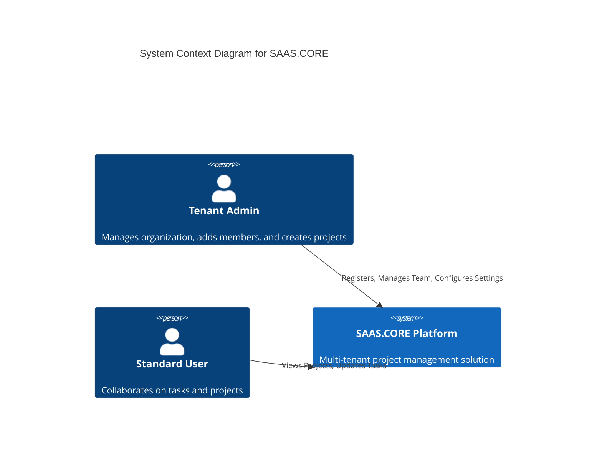
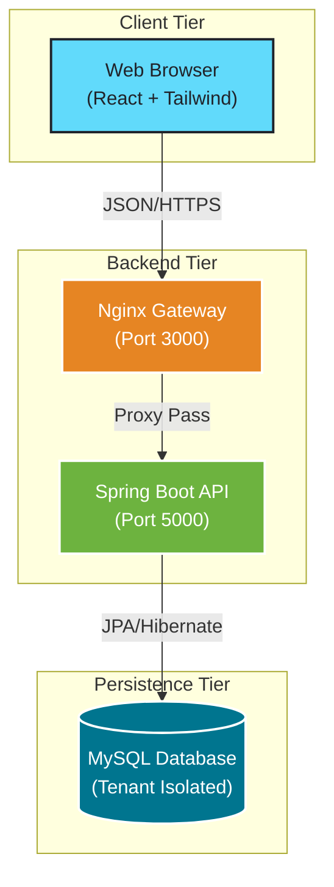
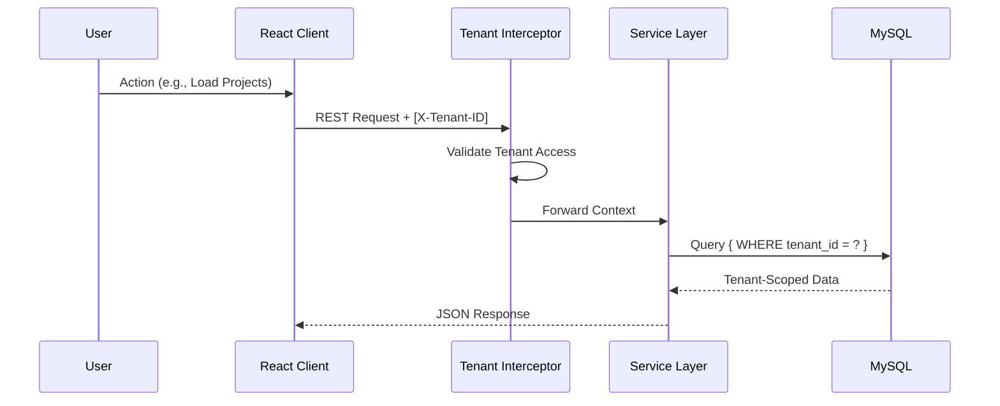
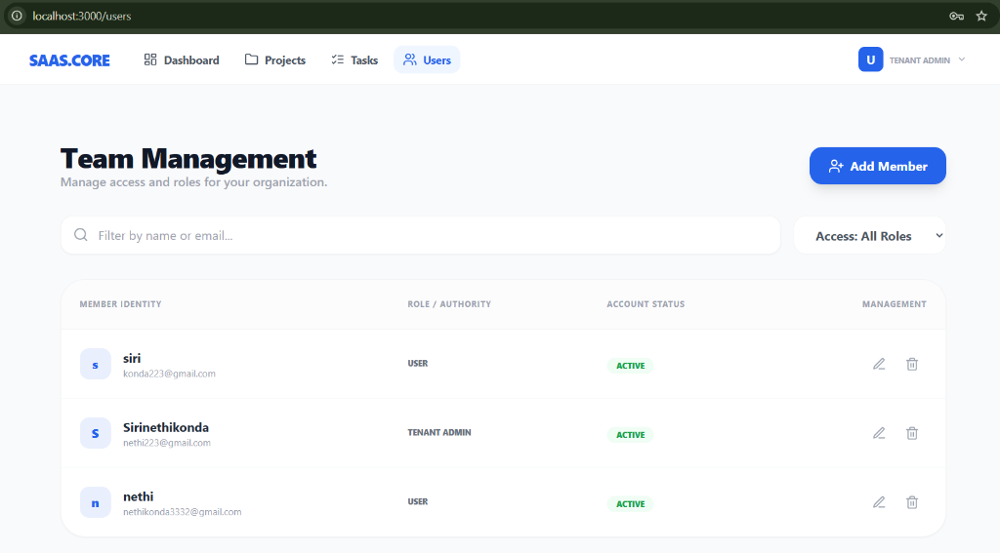
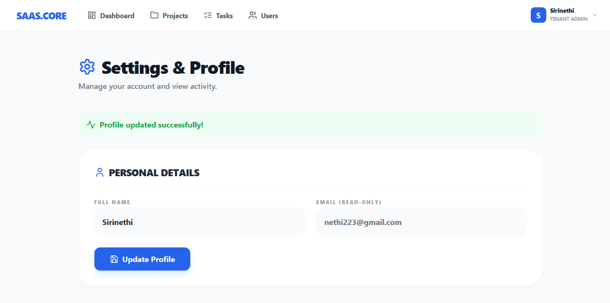
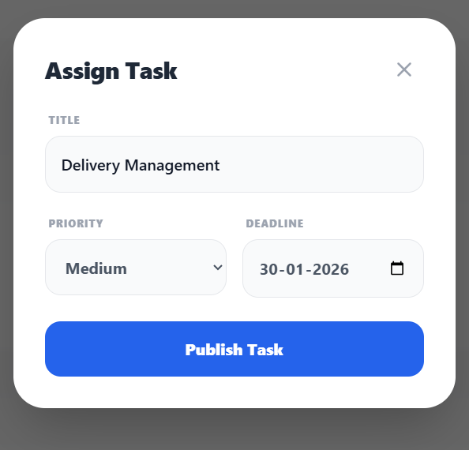
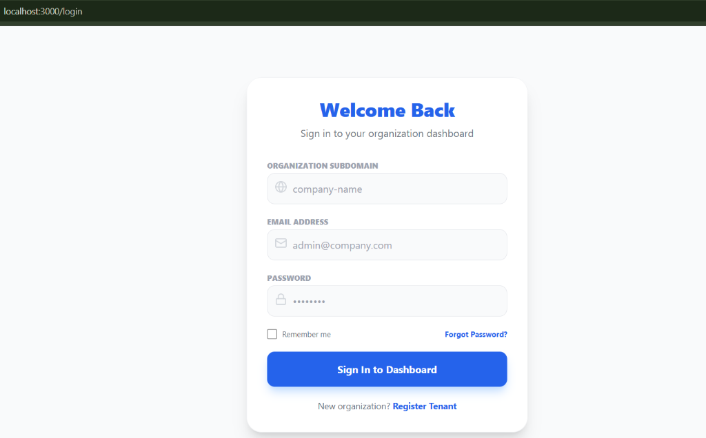
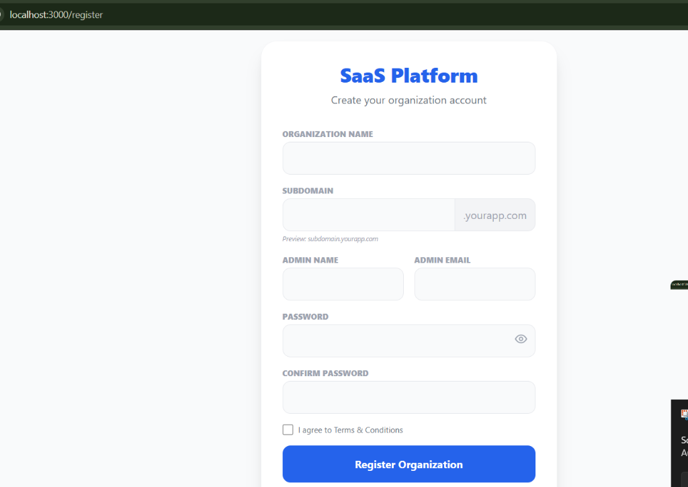

#  SAAS.CORE Platform
### Multi-Tenant Project Management System

     

**SAAS.CORE** is an enterprise-grade, multi-tenant SaaS solution designed for seamless project and team collaboration. Engineered with a strict data isolation architecture, it ensures secure partitioning across the frontend, API, and database layers.

---

##  Key Features

| Feature | Description |
| :--- | :--- |
| **📊 Dashboard Analytics** | Real-time insights into total projects, task completion rates, and active workspace metrics. |
| **🔒 Multi-Tenant Security** | Automatic `X-Tenant-ID` injection and validation ensuring strict data isolation per organization. |
| **📁 Project Workspace** | comprehensive tools for project lifecycle management, from initialization to archiving. |
| **✅ Kanban Task Manager** | Intuitive task tracking (Todo, In-Progress, Completed) with priority flagging and deadlines. |
| **👥 RBAC Administration** | Role-Based Access Control allowing Admin/User hierarchies for secure team management. |
| **🛡️ Activity Auditing** | Detailed audit logs tracking all critical system actions for compliance and security. |

---

##  Technology Stack

### **Backend Core**
*   **Framework**: Java 17, Spring Boot 3
*   **Security**: Spring Security (JWT + Custom Tenant Interceptors)
*   **Persistence**: Spring Data JPA, Hibernate, MySQL
*   **Build Tool**: Maven

### **Frontend Interface**
*   **Library**: React 18 (Vite)
*   **Styling**: Tailwind CSS
*   **Components**: Lucide Icons
*   **State**: React Context API

### **Infrastructure**
*   **Containerization**: Docker & Docker Compose
*   **Gateway**: Nginx (Reverse Proxy)

---

## 🏗️ System Architecture

### 1. System Context (C4)


### 2. Micro-Container Architecture


### 3. Multi-Tenant Request Flow


---

## 📸 Application Gallery

### **Core Workspaces**
| Intelligence Dashboard | Project Hub | Task Kanban |
|:---:|:---:|:---:|
|  |  |  |

### **Administration & Profile**
| Team Board | User Settings | Security Center |
|:---:|:---:|:---:|
|  |  |  |

### **Interactive Modals**
| Project Creation | Task Assignment | Member Onboarding |
|:---:|:---:|:---:|
|  |  |  |

### **Authentication**
| Secure Login | Organization Registration |
|:---:|:---:|
|  |  |

---

##  Getting Started

### Prerequisites
*   Docker Desktop & Docker Compose
*   Node.js (for local dev)

### Installation
1.  **Clone & Build**
    ```bash
    git clone https://github.com/your-org/saas-core.git
    cd saas-core
    docker-compose up --build -d
    ```

2.  **Access the Platform**
    *   **Frontend**: [http://localhost:3000](http://localhost:3000)
    *   **Backend API**: [http://localhost:5000](http://localhost:5000)

3.  **Initial Setup**
    1.  Go to `http://localhost:3000/register` to create your Organization (Tenant).
    2.  Login with your Admin credentials.
    3.  Start creating projects and inviting team members!

---

## 🧪 API Developer Guide

Common payloads for testing via **Postman** or **cURL**.

### 1. Register Organization
**POST** `http://localhost:5000/api/auth/register/tenant`
```json
{
  "name": "Tesla Innovations",
  "subdomain": "tesla",
  "adminEmail": "elon@tesla.com",
  "password": "SecurePassword123!"
}
```

### 2. User Login
**POST** `http://localhost:5000/api/auth/login`
```json
{
  "email": "elon@tesla.com",
  "password": "SecurePassword123!",
  "tenantSubdomain": "tesla"
}
```

### 3. Create Project
**POST** `http://localhost:5000/api/projects`
*(Requires `Authorization: Bearer <token>`)*
```json
{
  "name": "Mars Mission Controller",
  "description": "Navigation systems for Starship",
  "status": "active"
}
```

---

## Project Structure
```bash
/saas-core
├── /backend            # Spring Boot Application
│   ├── /config         # Security & Tenant Config
│   ├── /modules        # Domain Logic (User, Project, Task)
│   └── /core           # Shared Utilities
├── /frontend           # React Application
│   ├── /src/pages      # Route Views
│   └── /src/components # Reusable UI
└── docker-compose.yml  # Orchestration
```

---


