#  SAAS.CORE Platform
### Multi-Tenant Project Management System

     


**SAAS.CORE** is an enterprise-grade, multi-tenant SaaS solution designed for seamless project and team collaboration. Engineered with a strict data isolation architecture, it ensures secure partitioning across the frontend, API, and database layers.


---

##  Project Demo
Watch the full platform walkthrough and feature demonstration on YouTube:
### **[🎥 Watch the Demo Video](https://youtu.be/-05WgYbx8qE)**

---


##  Key Features

| Feature | Description |
| :--- | :--- |
| ** Dashboard Analytics** | Real-time insights into total projects, task completion rates, and active workspace metrics. |
| ** Multi-Tenant Security** | Automatic `X-Tenant-ID` injection and validation ensuring strict data isolation per organization. |
| ** Project Workspace** | comprehensive tools for project lifecycle management, from initialization to archiving. |
| ** Kanban Task Manager** | Intuitive task tracking (Todo, In-Progress, Completed) with priority flagging and deadlines. |
| ** RBAC Administration** | Role-Based Access Control allowing Admin/User hierarchies for secure team management. |
| ** Activity Auditing** | Detailed audit logs tracking all critical system actions for compliance and security. |

---

##  Technology Stack

### **Backend Core**
*   **Framework**: Java 17, Spring Boot 3
*   **Security**: Spring Security (JWT + Custom Tenant Interceptors)
*   **Persistence**: Spring Data JPA, Hibernate, MySQL
*   **Build Tool**: Maven

### **Frontend Interface**
*   **Library**: React 18 (Vite)
*   **Styling**: Tailwind CSS
*   **Components**: Lucide Icons
*   **State**: React Context API

### **Infrastructure**
*   **Containerization**: Docker & Docker Compose
*   **Gateway**: Nginx (Reverse Proxy)

---

##  Getting Started

### Prerequisites
*   Docker Desktop & Docker Compose
*   Node.js (for local dev)

### Installation
1.  **Clone & Build**
    ```bash
    git clone https://github.com/your-org/saas-core.git
    cd saas-core
    docker-compose up --build -d
    ```

2.  **Access the Platform**
    *   **Frontend**: [http://localhost:3000](http://localhost:3000)
    *   **Backend API**: [http://localhost:5000](http://localhost:5000)

3.  **Initial Setup**
    1.  Go to `http://localhost:3000/register` to create your Organization (Tenant).
    2.  Login with your Admin credentials.
    3.  Start creating projects and inviting team members!

---


##  System Architecture

### 1. System Context (C4)
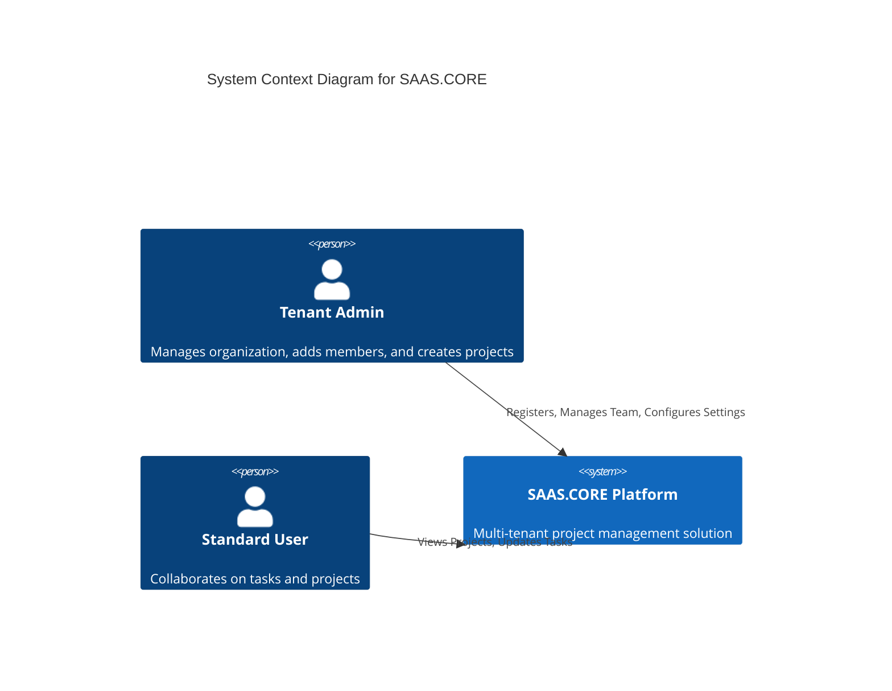
```mermaid
C4Context
    title System Context Diagram for SAAS.CORE
    Person(admin, "Tenant Admin", "Manages organization, adds members, and creates projects")
    Person(user, "Standard User", "Collaborates on tasks and projects")
    System(saas_platform, "SAAS.CORE Platform", "Multi-tenant project management solution")
    Rel(admin, saas_platform, "Registers, Manages Team, Configures Settings")
    Rel(user, saas_platform, "Views Projects, Updates Tasks")
```

### 2. Micro-Container Architecture
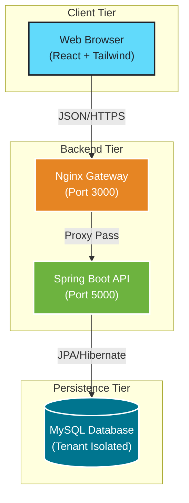
```mermaid
graph TD
    subgraph Client [Client Tier]
        Browser["Web Browser<br/>(React + Tailwind)"]:::browser
    end
    subgraph Server [Backend Tier]
        LB["Nginx Gateway<br/>(Port 3000)"]:::lb
        API["Spring Boot API<br/>(Port 5000)"]:::java
    end
    subgraph Data [Persistence Tier]
        DB[("MySQL Database<br/>(Tenant Isolated)")]:::db
    end

    classDef browser fill:#61dafb,stroke:#20232a,stroke-width:2px,color:#20232a;
    classDef java fill:#6db33f,stroke:#fff,stroke-width:2px,color:#fff;
    classDef db fill:#00758f,stroke:#fff,stroke-width:2px,color:#fff,shape:cylinder;
    classDef lb fill:#e68523,stroke:#fff,stroke-width:2px,color:#fff;

    Browser -->|JSON/HTTPS| LB
    LB -->|Proxy Pass| API
    API -->|JPA/Hibernate| DB
```

### 3. Multi-Tenant Request Flow
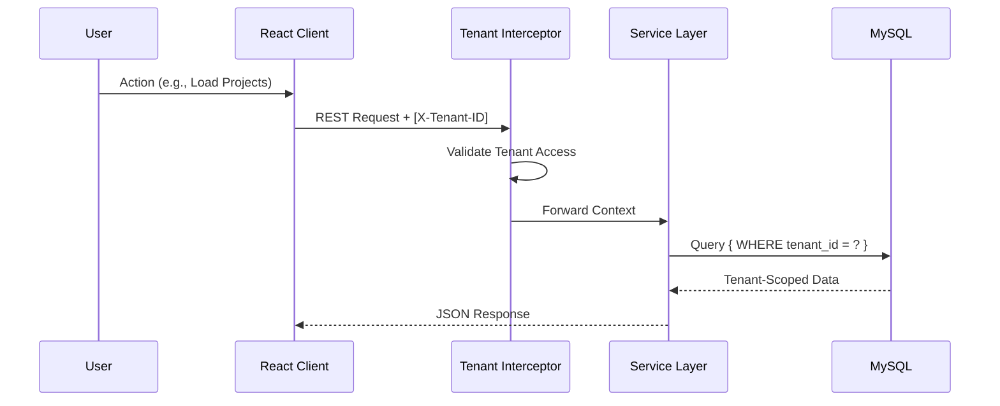
```mermaid
sequenceDiagram
    participant User
    participant App as React Client
    participant Interceptor as Tenant Interceptor
    participant Service as Service Layer
    participant DB as MySQL

    User->>App: Action (e.g., Load Projects)
    App->>Interceptor: REST Request + [X-Tenant-ID]
    Interceptor->>Interceptor: Validate Tenant Access
    Interceptor->>Service: Forward Context
    Service->>DB: Query { WHERE tenant_id = ? }
    DB-->>Service: Tenant-Scoped Data
    Service-->>App: JSON Response
```

---

##  Application Gallery

### **Core Workspaces**
| Intelligence Dashboard | Project Hub | Task Kanban |
|:---:|:---:|:---:|
| 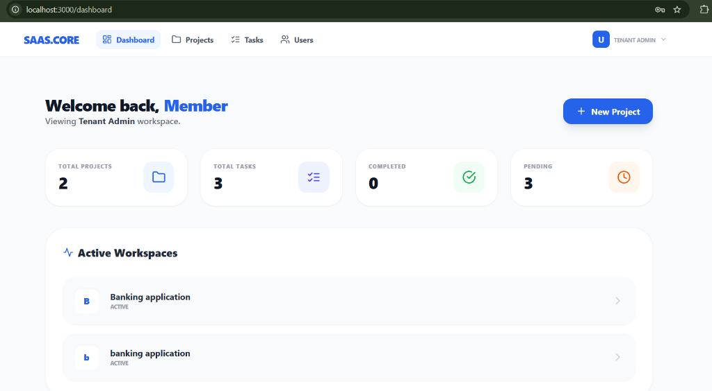 | 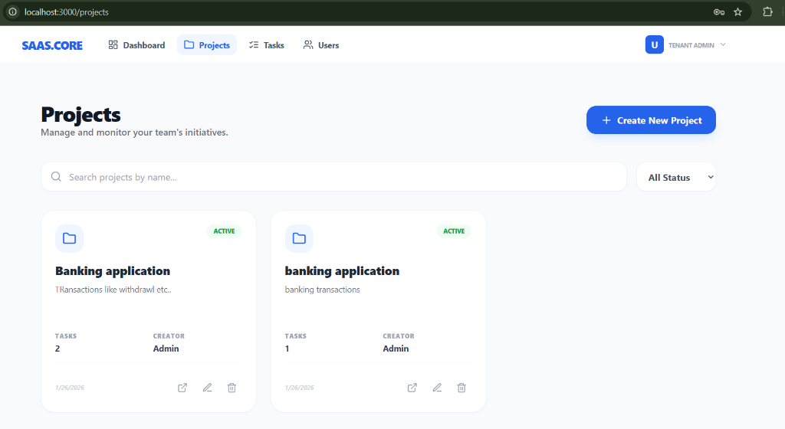 | 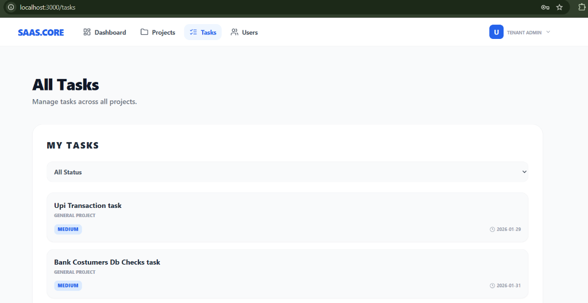 |

### **Administration & Profile**
| Team Board | User Settings | Security Center |
|:---:|:---:|:---:|
| 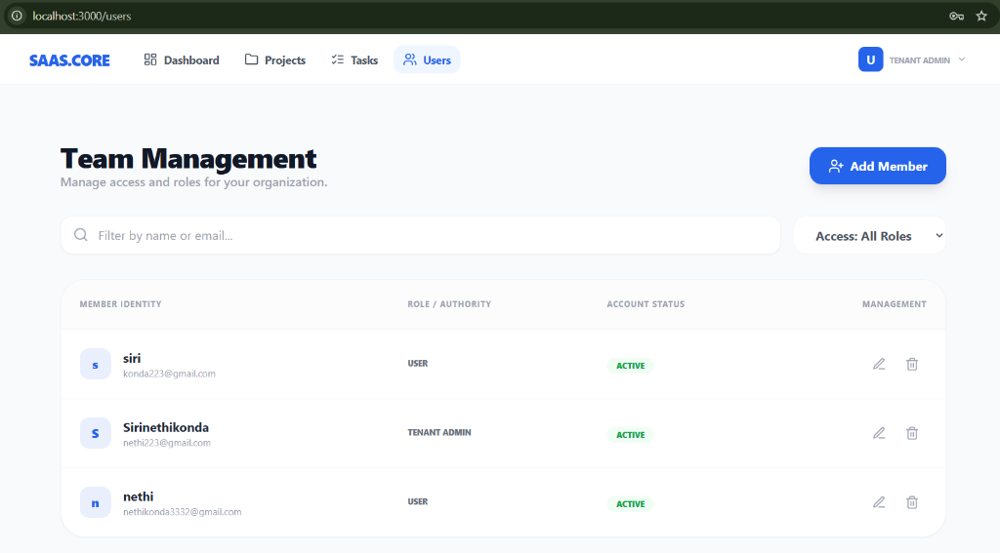 | 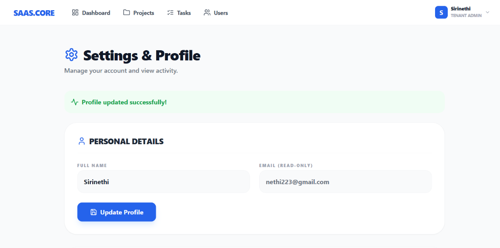 | 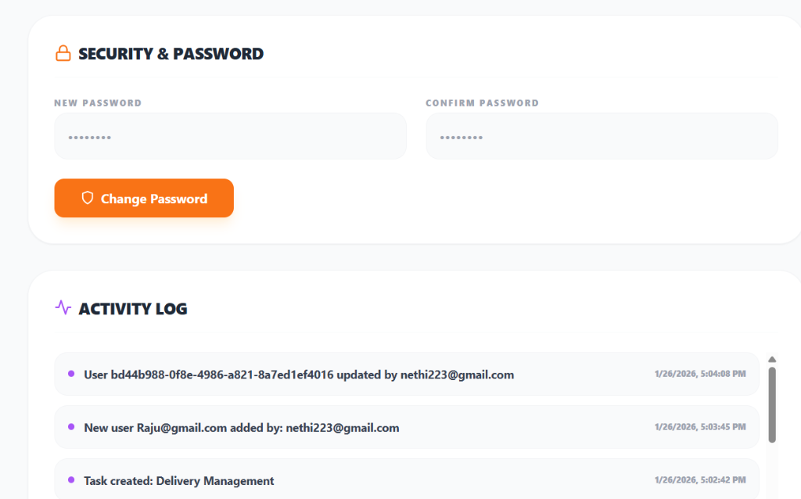 |

### **Interactive Modals**
| Project Creation | Task Assignment | Member Onboarding |
|:---:|:---:|:---:|
| 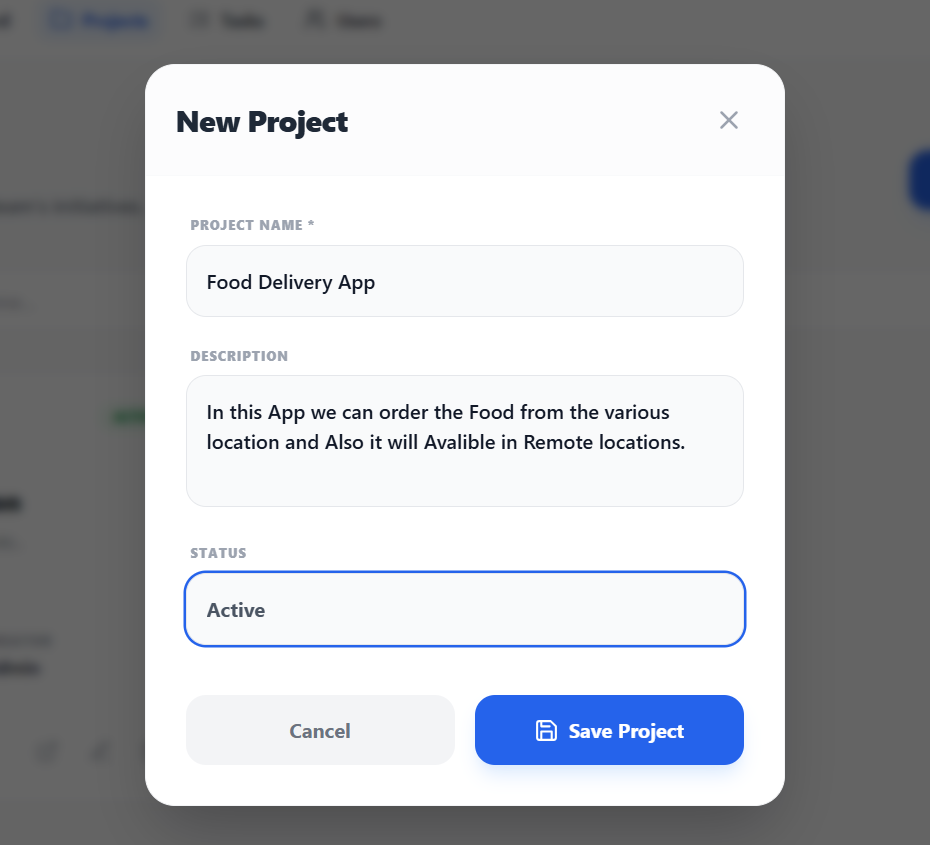 | 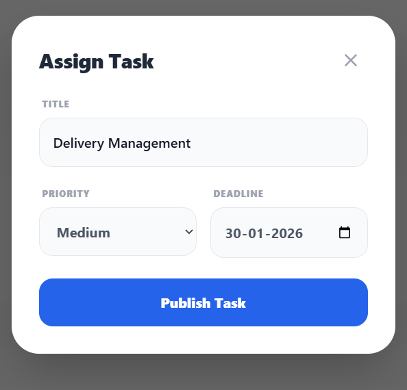 | 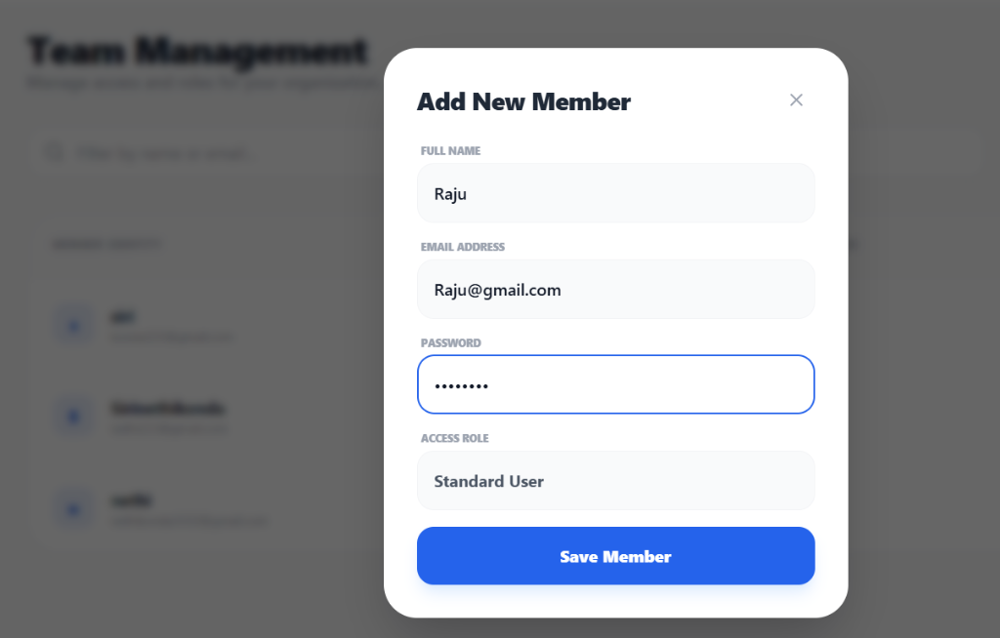 |

### **Authentication**
| Secure Login | Organization Registration |
|:---:|:---:|
| 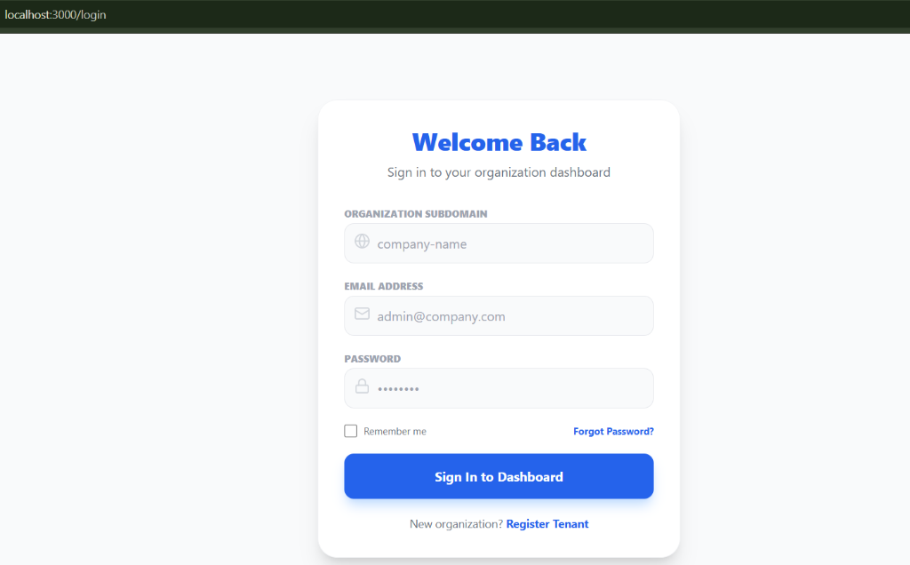 | 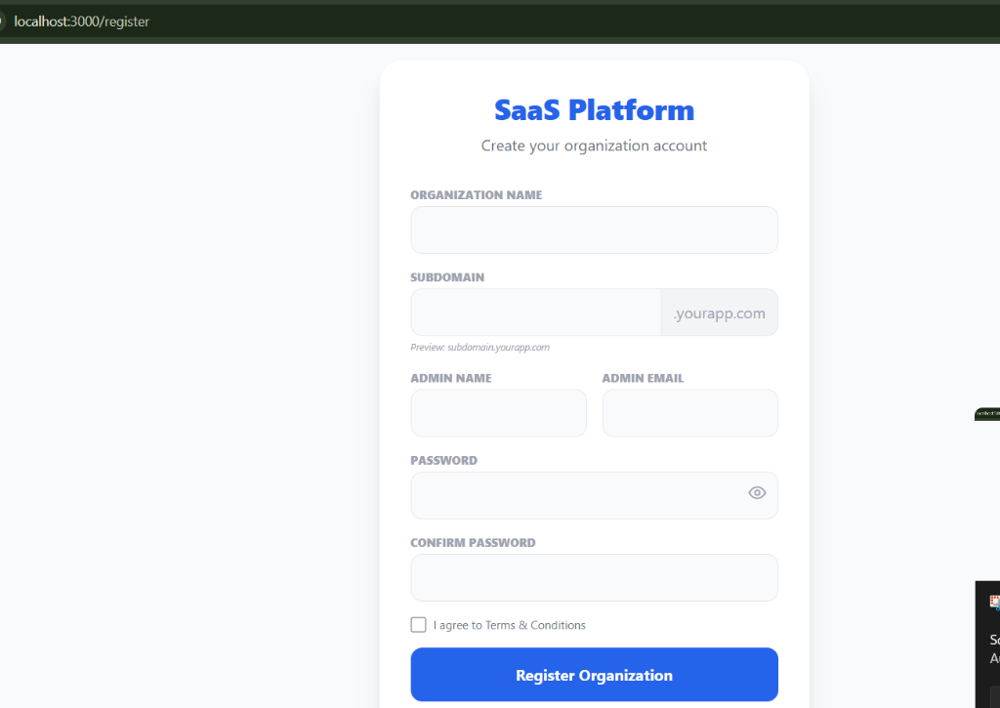 |

---

##  API Evaluation Suite
**Comprehensive test suite containing all 19 mandatory endpoints.**

### 🛠️ Live Testing with Postman
1.  Import the [saas_core_postman_collection.json](saas_core_postman_collection.json) found in the root directory.
2.  All 19 endpoints are organized by module (Auth, Tenant, User, Project, Task).
3.  Seed data is pre-configured to work with these requests immediately.

### 📋 Endpoint Summary (Total: 19)
| Module | Endpoint | Method | Role Required |
| :--- | :--- | :--- | :--- |
| **Auth** | `/api/auth/register-tenant` | POST | Public |
| | `/api/auth/login` | POST | Public |
| | `/api/auth/me` | GET | Authenticated |
| | `/api/auth/logout` | POST | Authenticated |
| **Tenant** | `/api/tenants/{id}` | GET | Admin / Super |
| | `/api/tenants/{id}` | PUT | Admin / Super |
| | `/api/tenants` | GET | Super Admin |
| **User** | `/api/tenants/{id}/users` | POST | Admin |
| | `/api/tenants/{id}/users` | GET | Member |
| | `/api/users/{id}` | PUT | Admin / Self |
| | `/api/users/{id}` | DELETE | Admin |
| **Project** | `/api/projects` | POST | Member |
| | `/api/projects` | GET | Member |
| | `/api/projects/{id}` | PUT | Admin / Lead |
| | `/api/projects/{id}` | DELETE | Admin / Lead |
| **Task** | `/api/projects/{id}/tasks` | POST | Member |
| | `/api/projects/{id}/tasks` | GET | Member |
| | `/api/tasks/{id}/status` | PATCH | Member |
| | `/api/tasks/{id}` | PUT | Member |

---

## Project Structure
```bash
/saas-core
├── /backend            # Spring Boot Application
│   ├── /config         # Security & Tenant Config
│   ├── /modules        # Domain Logic (User, Project, Task)
│   └── /core           # Shared Utilities
├── /frontend           # React Application
│   ├── /src/pages      # Route Views
│   └── /src/components # Reusable UI
└── docker-compose.yml  # Orchestration
```

---

##  Project Documentation

The `docs/` folder contains detailed technical specifications and design documents:

| Document | Description |
| :--- | :--- |
| [**API Reference**](docs/API.md) | Endpoints, authentication flows, and JSON payload examples. |
| [**Product Requirements (PRD)**](docs/PRD.md) | User personas, functional requirements, and non-functional constraints. |
| [**System Architecture**](docs/architecture.md) | C4 context diagrams, container architecture, and database ERD. |
| [**Research & Analysis**](docs/research.md) | Strategic analysis of multi-tenancy approaches and technology stack choices. |
| [**Technical Specification**](docs/technical-spec.md) | Detailed folder structure, development setup, and environment configuration. |


#

---
© 2026 Multi-Tenant SaaS Project. All Rights Reserved.

---


