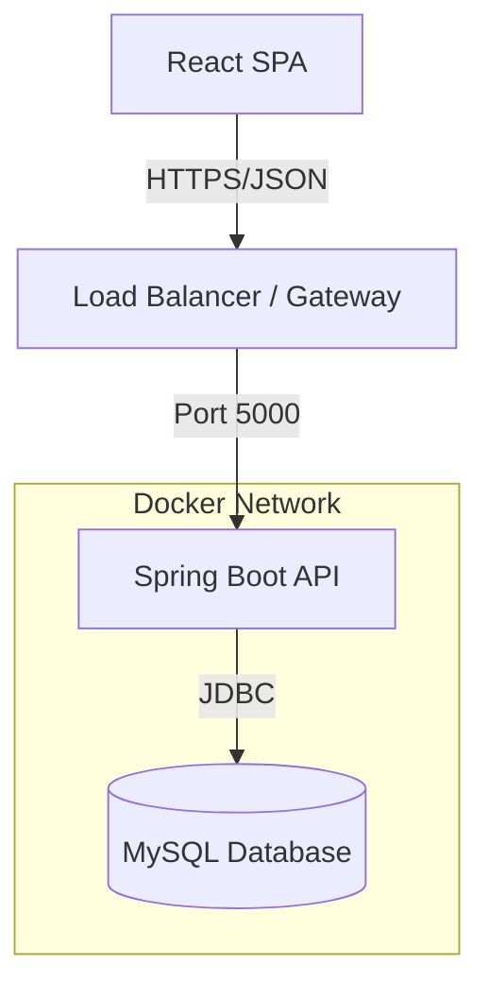
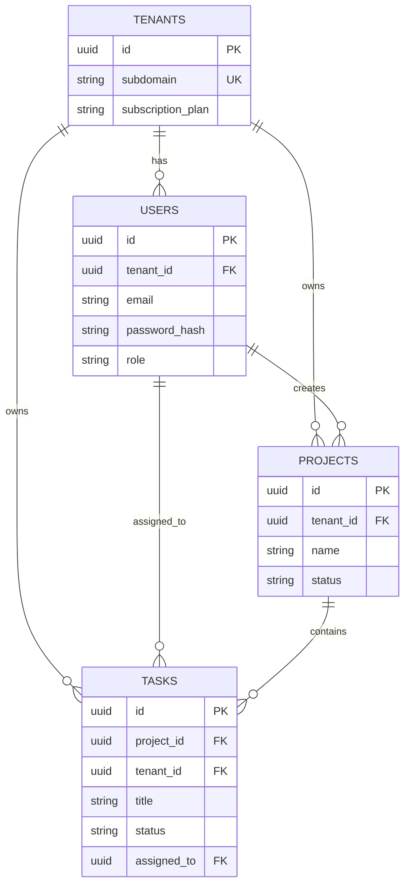

# System Architecture

## 1. High-Level Architecture

The SAAS.CORE platform follows a classic 3-tier architecture, containerized for easy deployment.

*   **Client Tier**: Single Page Application (SPA) built with React and Tailwind CSS. It communicates with the backend via RESTful APIs over HTTP/HTTPS.
*   **Application Tier**: Spring Boot backend handling business logic, authentication, and authorization. It is stateless and scales horizontally.
*   **Data Tier**: MySQL database responsible for persistent storage. It utilizes a shared-schema multi-tenancy model.

### Mermaid Diagram

## 2. Database Schema (ERD)

The database uses a Shared Schema approach. All tables (except strictly global ones) have `tenant_id` as a foreign key to the `tenants` table.

### Core Entities & Relationships

*   **Tenants**: The root entity. Defines the isolation boundary.
*   **Users**: Belong to a Tenant. Login is scoped to the Tenant (via subdomain).
*   **Projects**: Created by Users, scoped to a Tenant.
*   **Tasks**: Belong to a Project, scoped to a Tenant. Assigned to Users within the same Tenant.

### Mermaid ERD

## 3. API Architecture

The API involves 19 endpoints categorized by module. All endpoints (except Auth) require a valid JWT token.

### Authentication Module
*   `POST /api/auth/register-tenant`: Register new organization
*   `POST /api/auth/login`: User login
*   `GET /api/auth/me`: Get current user profile
*   `POST /api/auth/logout`: Logout user

### Tenant Module
*   `GET /api/tenants`: List all tenants (Super Admin only)
*   `GET /api/tenants/{id}`: Get tenant details
*   `PUT /api/tenants/{id}`: Update tenant details

### User Module
*   `GET /api/tenants/{id}/users`: List users in tenant
*   `POST /api/tenants/{id}/users`: Add user to tenant
*   `PUT /api/users/{id}`: Update user
*   `DELETE /api/users/{id}`: Delete user

### Project Module
*   `POST /api/projects`: Create project
*   `GET /api/projects`: List projects
*   `GET /api/projects/{id}`: Get project details
*   `PUT /api/projects/{id}`: Update project
*   `DELETE /api/projects/{id}`: Delete project

### Task Module
*   `POST /api/projects/{id}/tasks`: Create task
*   `GET /api/projects/{id}/tasks`: List tasks in project
*   `PUT /api/tasks/{id}`: Update task
*   `PATCH /api/tasks/{id}/status`: Update task status
*   `DELETE /api/tasks/{id}`: Delete task
